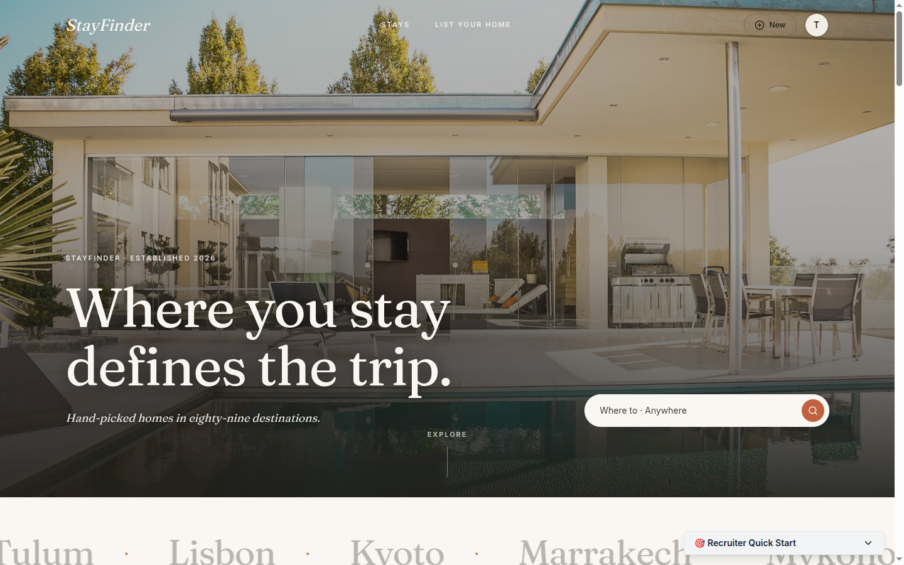
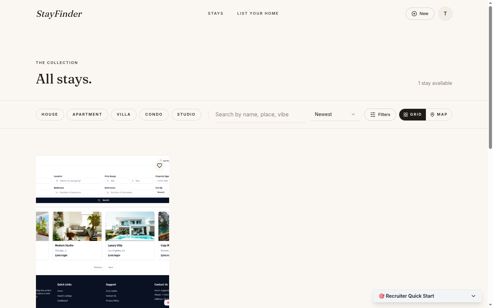
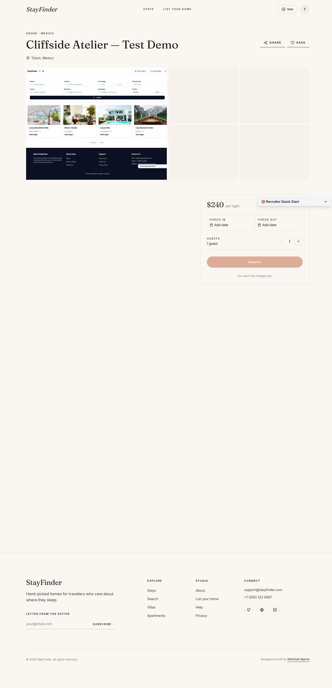
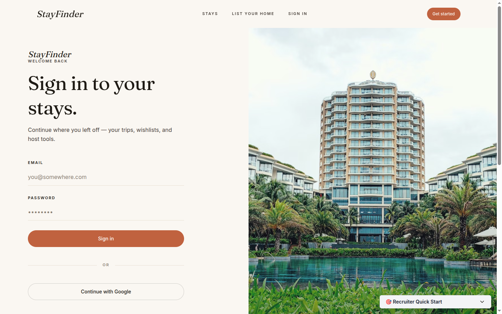
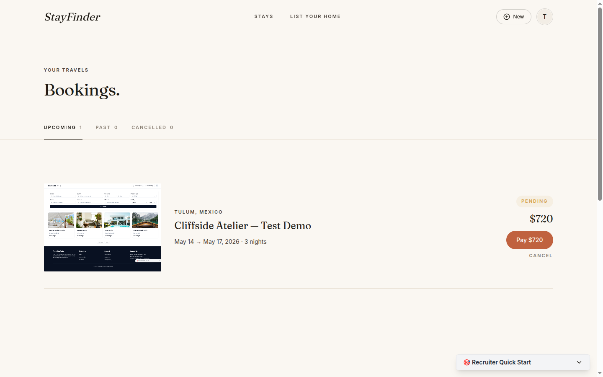
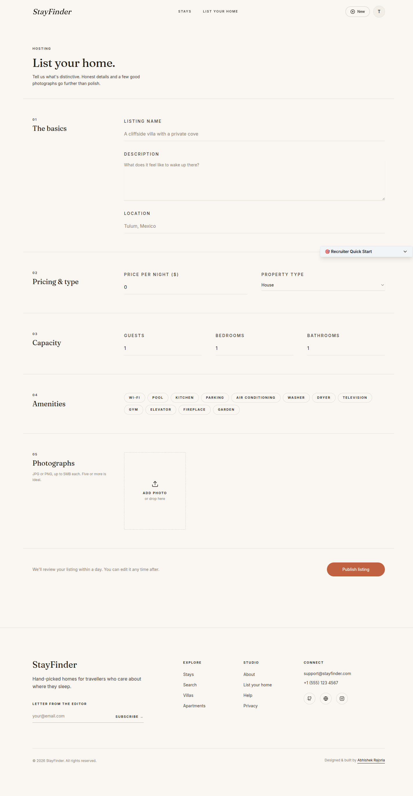
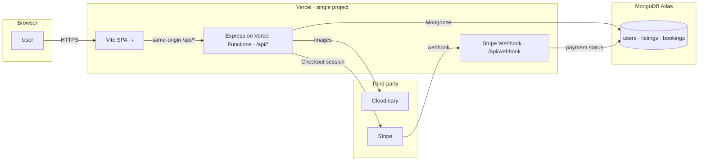

# StayFinder

> A warm-editorial Airbnb-style marketplace. Built solo as a portfolio piece and a freelance landing-page demonstrator.

**Live demo** → [stayfinder-eta.vercel.app](https://stayfinder-eta.vercel.app/)
**API health** → [stayfinder-eta.vercel.app/api/health](https://stayfinder-eta.vercel.app/api/health)
**Portfolio** → [abhishek-rajoria.vercel.app](https://abhishek-rajoria.vercel.app/)

---

## What this is

A full-stack property booking platform — auth, hostable listings with image upload, search & filter, calendar-aware bookings with Stripe payments. Functionally Airbnb-shaped; visually a magazine.

The visual identity is the point. Most clones reach for shadcn defaults and call it done. This one was rebuilt around a warm editorial aesthetic — Fraunces display serif, terracotta-on-cream palette, sharp 2px corners, slow magazine-grade motion — to look like the kind of project a freelance hospitality, lifestyle, or real-estate client would want their landing page to feel like.

## Showcase

### Home — full-bleed editorial hero, marquee ticker, featured stays


### Listings — sticky filter bar, pill chips, cardless grid


### Listing detail — image collage, sticky booking widget, host card


### Login — split-screen with full-height Ken Burns imagery


### Bookings — text-link tabs, editorial rows


### Create listing — numbered editorial sections, underline inputs, amenity pills


## Highlights

- **Hand-crafted editorial design system** — not "shadcn defaults plus a logo." Custom token system, fluid type scale, three-primitive motion language, ten editorial components built on top of shadcn primitives.
- **Listings → search → book → pay** end-to-end, with date-overlap detection, Cloudinary image hosting, and Stripe Checkout (test mode + webhooks).
- **Role-based access** — guest by default, auto-promoted to host on first listing creation. Hosts get their own dashboards and reservation views.
- **Slow, intentional motion** — scroll-revealed sections, marquee location ticker, image carousel inside cards, lightbox-with-keyboard for property photos. Respects `prefers-reduced-motion`.
- **Hardened backend** — Helmet + compression + per-route rate limiting (auth: 20/15min, api: 300/15min). Webhook route registered before body parsers. JWT in HTTP-only cookies.

## Stack

| Layer       | Choice                                      | Why |
|-------------|---------------------------------------------|-----|
| Frontend    | React 18 + TypeScript + Vite                | Fast HMR, type-safe, zero magic |
| Styling     | Tailwind CSS + shadcn/ui (Radix primitives) | Composable, accessible, themable |
| State / Data| TanStack Query + AuthContext                 | Server-cache where it belongs; minimal global state |
| Forms       | React Hook Form + Zod                       | Validated, controlled, ergonomic |
| Animation   | framer-motion                                | Coherent motion primitives, reduced-motion aware |
| Backend     | Node.js + Express + TypeScript              | Familiar, fast iteration |
| Database    | MongoDB + Mongoose                          | JSON-shape models map cleanly to listings/bookings |
| Auth        | JWT (cookies) + bcryptjs                    | Stateless, simple |
| Uploads     | Multer + Cloudinary                         | CDN-backed image pipeline |
| Payments    | Stripe Checkout + webhooks                  | PCI-out-of-scope, low integration cost |
| Hosting     | Vercel — single project                     | Frontend at `/`, serverless functions at `/api/*` (same origin) |

## Architecture



## Project structure

Single Vercel project — frontend at `/`, serverless API at `/api/*`.

```
StayFinder/
├── api/                          # Vercel serverless entry
│   └── index.ts                  # @vercel/node — re-exports the Express app
├── src/                          # Express + Mongoose API source
│   ├── app.ts                    # express() instance
│   ├── index.ts                  # Local dev: connectDB() then app.listen
│   ├── routes/                   # auth · listings · bookings · payments · webhooks
│   ├── controllers/              # Business logic per resource
│   ├── models/                   # User · Listing · Booking
│   ├── middleware/               # auth · upload · errorHandler
│   └── config/                   # env validation, cached Mongoose connect
├── client/                       # React frontend (Vite)
│   └── src/
│       ├── api/                  # Per-resource axios modules
│       ├── components/
│       │   ├── editorial/        # Custom design-system primitives
│       │   ├── listing/          # BookingForm, EditListingModal, …
│       │   ├── ui/               # shadcn/ui base (themed)
│       │   ├── auth/             # AuthSplit shared layout
│       │   └── layouts/          # RootLayout, Footer
│       ├── hooks/                # useAuth, useDebouncedValue
│       ├── pages/                # Route-level views
│       └── styles/               # Font imports
├── package.json                  # Root: backend + Vercel scripts
├── tsconfig.json                 # Root: backend tsconfig (client has its own)
├── vercel.json                   # Vite framework + functions + rewrites
└── docs/superpowers/
    ├── specs/                    # Design specs
    └── plans/                    # Implementation plans
```

## Demo accounts

```
recruiter@stayfinder.dev  ·  demo123   (host  — has 3 listings + 2 bookings)
guest@stayfinder.dev      ·  demo123   (guest — has 2 confirmed bookings)
```

> Stripe test card: `4242 4242 4242 4242` · any future date · any CVC · any ZIP.

## Local setup

```bash
# 1. Clone
git clone https://github.com/Abhishek1334/StayFinder.git
cd StayFinder

# 2. Install both
npm install                        # backend deps at root
cd client && npm install && cd ..  # frontend deps in client/

# 3. Backend env
cp .env.example .env               # fill MONGODB_URI, JWT_*, CLOUDINARY_*, STRIPE_*

# 4. Run both — two terminals
npm run dev:server                 # → http://localhost:5000  (Express)
cd client && npm run dev           # → http://localhost:5173  (Vite — proxies /api → :5000)
```

## Featured pages

- **Home** (`/`) — full-bleed hero with shapeshifting search pill, marquee location ticker, featured stays rail, editorial split, destinations grid, pull quote, stats strip, host CTA.
- **Listings** (`/listings`) — sticky thin filter bar with property-type pill chips, debounced search, cardless 3-column grid, map-toggle stub.
- **Listing details** (`/listings/:id`) — 1+4 image collage with keyboard-driven lightbox, sticky booking widget with date pickers + guest stepper + total breakdown, host card, amenities grid, reviews stub, location stub.
- **Login / Register** — split-screen with full-height Ken Burns travel imagery on the right.
- **Bookings** — text-link tabs (Upcoming / Past / Cancelled), editorial booking rows, magazine-style empty state.
- **Dashboard** — "your atelier" reframe with role-aware stats strip and two-column row lists.

## What I learned (lessons applied)

- **Default UI libraries leak through.** shadcn is fantastic plumbing but you have to actively *override* its design language to escape the SaaS default look. The biggest single visual lift was deleting drop shadows, adopting 2px corners, and committing to Fraunces.
- **Motion language > animation count.** Three primitives (lift-in, image curtain reveal, cursor tilt) used everywhere coheres better than ten different effects scattered across pages.
- **Server-cache > global client state.** I started with Redux Toolkit + redux-persist for everything, and standardized on TanStack Query for server data + AuthContext for session. Less code, fewer sync bugs.
- **Cold-start banners are credibility tax.** "Backend may take 10s to wake up" notices on a free-tier host signal junior. The right fix is to not have cold starts.
- **Photography is the design.** A travel marketplace can never be more polished than its imagery. I curated 30+ Unsplash photos before designing a single component.

## What's NOT in this build (deliberate scope freeze)

The project is frozen as of v2.0. The following were considered and explicitly cut:

- Real review system backend (UI stub only)
- Real-time host↔guest chat (would be 4 days of work for a feature recruiters never test)
- AI-generated listing descriptions
- i18n + currency switcher
- Tests + CI (worth doing, not worth gating this milestone)
- Multi-step listing creation wizard (single-page form retained for v2)
- Real Google OAuth (placeholder button only)

The scope was capped because every additional week here is a week not spent on the next, more distinctive project.

## Credits

- Design vocabulary informed by Plum Guide, Sonder, Aman, Faena, Habitas, Cereal magazine.
- Photography sourced from [Unsplash](https://unsplash.com).
- Built solo by [Abhishek Rajoria](https://abhishek-rajoria.vercel.app).
